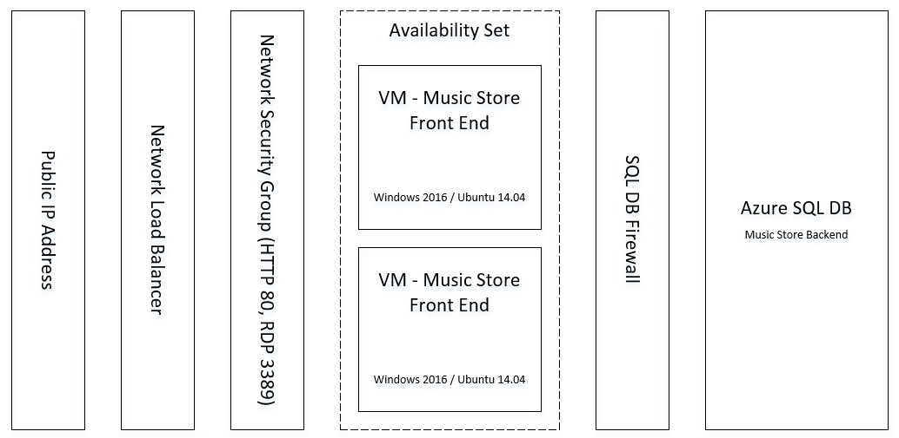

# Deploy Two Tier Application on Linux and Azure SQL DB

This template deploys a two tier demo application and all necessary infrastructural components. When deployed, the resulting resource group will contain a fully working, highly available, and secure application. Deploy the Azure resource group and application using the below button. Once completed, the application can be access on the Azure public IP address or or public DNS name. 

The deployment command line would be something like this (minus the CRs):

az group deployment create -n dotnet-core-music-linux --resource-group dinoarmtest02 
--template-uri https://raw.githubusercontent.com/dinorows/TCO490/master/dotnet-core-music-linux/azuredeploy.json 
--parameters "{'sshKeyData': {'value': 'ssh-rsa AAAAB3NzaC1yc2EAAAADAQABAAAC<...>bw== dino@abc.fgh'},
'sqlAdminPassword': {'value': 'My5q1P@s5w0rd!'},'adminUsername': {'value': 'dino'},
'numberOfInstances': {'value':2},'publicipaddressDnsName': {'value': '<dino>publicip978'}}"

Where it says <dino> you need to replace it with your name. And obviously you need to replace the value of sshKeyData with your own RSA public key, usually to be found in file ~/.ssh/id_rsa.pub, if you don't have one, create a public/private key pair with ssh-keygen (https://www.ssh.com/ssh/keygen/).
The application architecture is similar to this:

